<!-- Every visual in this README lives in /assets and is generated by scripts/build_assets.py.
     To change any text, stat or hackathon: edit the data at the top of that script and re-run it. -->


  

&nbsp;&nbsp;

  

&nbsp;

 


I'm an **AI engineer and founder** who builds where **computer vision, large language models and real products** meet. I'm pursuing a **B.Tech in Artificial Intelligence & Data Science**, but my sharpest lessons have come from the hackathon floor: **8 podium finishes** and a **Top 10 out of 28,000** at *India Innovates* taught me how to take a blank whiteboard to a working demo, and then pitch it to the room.

Right now I'm building **Neuronest**, an AI + VR platform for mental-health therapy, and going deep on **agentic AI**, **LoRA / QLoRA fine-tuning** and **GenAI systems that scale**. The bar I hold every project to: *technically strong, commercially viable, socially impactful.*


  



  



<b>📜 View the full record as text</b>

<!-- hackathons:start -->

| | Competition | Organiser | Level |
|:-:|:--|:--|:-:|
| 🥇 | **Geospatial Intelligence Hackathon 2026** | Open national hackathon | National |
| 🥇 | **HACKSTORM 2025** | National-level hackathon | National |
| 🥇 | **IdeaThon 2025** | ACEIT, Jaipur | Institute |
| 🥈 | **HackStorm** | Arya College of Engineering & IT, Jaipur | Institute |
| 🥈 | **DevSummit Hackathon** | Jagannath University | University |
| 🥈 | **Genisys 1.0** | MNIT Jaipur | Institute |
| 🥉 | **HackJKLU 5.0** | JKLU, Jaipur | Open |
| 🥉 | **AceHack Hackathon** | Open hackathon | Open |
| 🏁 | **India Innovates** | Bharat Mandapam, New Delhi | Top 10 of 28,000 |

<!-- hackathons:end -->

 



  


  

<picture>
  <source media="(prefers-color-scheme: dark)" srcset="https://raw.githubusercontent.com/ItzHimanshu007/ItzHimanshu007/output/snake.svg"/>
  <source media="(prefers-color-scheme: light)" srcset="https://raw.githubusercontent.com/ItzHimanshu007/ItzHimanshu007/output/snake-light.svg"/>
  
</picture>

 

<a href="mailto:hjasoriya007@gmail.com"></a>
